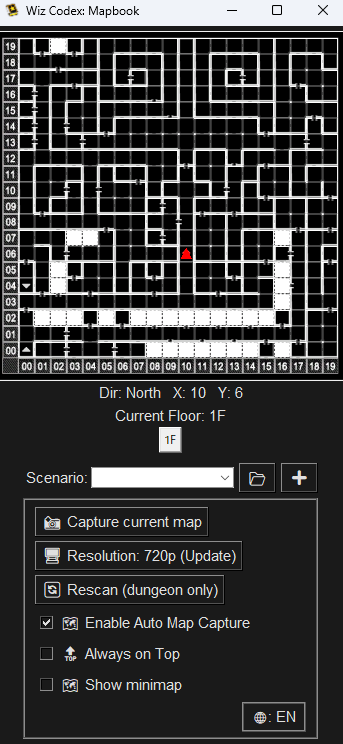
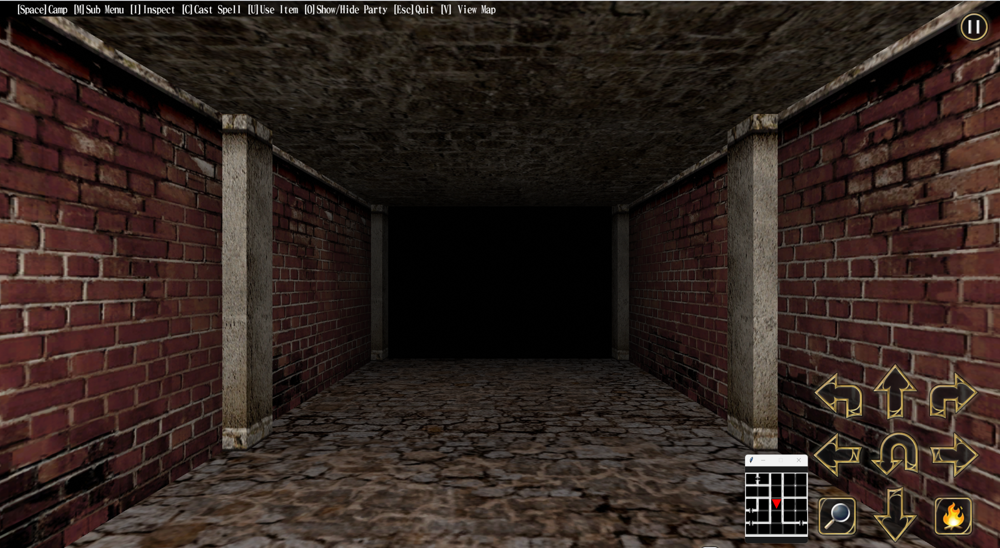

# Wiz Codex: Lifebook

❤️ Battle companion tool for *Wizardry: The Five Ordeals (Steam)*.  
Enter party HP during combat to lock → enemy HP becomes visible.  
Displays party HP with optional life bars, plus Always-on-Top mode.

---

# Wiz Codex: Mapbook

🧭 A lightweight companion tool to automatically capture and organize dungeon maps  
for *Wizardry: The Five Ordeals (Steam)* explorers.

---

## 💡 Features at a Glance

- Auto-captures the in-game map only when opened
- Floating minimap overlay (always on top, draggable)
- Scenario-based map folders
- English/Japanese toggle (🌐)
- Read-only memory scan (safe, non-intrusive)
  

*Main UI showing position, direction, floor, and map capture options.*

*Minimap overlaying the game screen (drag to move, always on top).*

---

## 🚀 Quick Start

1. Launch *Wizardry: The Five Ordeals* (Steam)
2. Start **Wiz Codex: Mapbook** *after* the game is running
3. Perform a **rescan** inside a dungeon if the game was restarted

→ Full guide and FAQ below 👇

---

## Overview

If this map refuses to cooperate, even magic might not help.  
A lightweight companion tool for explorers wandering the dungeons of *Wizardry: The Five Ordeals (Steam)*.

This tool automatically captures, organizes, and displays dungeon maps.  
It supports scenario folders, a floating minimap overlay, and both English/Japanese UI.

## Quick Start

1. **Launch Wizardry: The Five Ordeals (Steam).**
2. **Start Wiz Codex: Mapbook *after* the game is running.**  
   If the game is not running, this tool cannot connect and will not function properly.
3. **Perform an address rescan** the first time, or whenever the game has been restarted.  
   Make sure you are inside a dungeon (exploration mode) when doing this.
   - You do *not* need to rescan after returning to the title screen or resetting in-game.
   - A rescan is needed only after fully restarting the game application, as memory addresses change each time.
4. When the scan succeeds, your **direction**, **X/Y coordinates**, and **floor** will be displayed.
5. Select your current scenario from the dropdown menu.
   - Use the ➕ button to create a new scenario folder.
   - Click the 📂 button to open the folder where maps are saved.
6. Enable **Auto Map Capture** to save a screenshot automatically  
   when you open the in-game map screen (not during normal gameplay).
7. To display the minimap, enable the **Minimap** checkbox.  
   The minimap window stays always on top and can be freely dragged.
8. Click the 🌐 button to switch between English and Japanese.
9. To exit, simply close the window.

> **Note:**
> - Administrator rights may be required. If you see access errors, try running as administrator.
> - Windows only. Not compatible with other operating systems.
> - Game updates may affect compatibility; continued support is not guaranteed.
> - This tool is read-only. It does *not* modify game data or interfere with gameplay.
> - PyAutoGUI is used for automation and screenshots. Some antivirus software may flag this.
> - Use at your own risk.

## Features

- Multiple scenario folders (map images are organized per scenario)
- Floating minimap overlay (always on top, draggable)
- Address rescan:
  - Fast mode using known tail-hex patterns from CSV
  - Full scan fallback (10–30 sec) if needed
  - Game input is locked during scanning to prevent changes
- Auto map capture: triggered only when the in-game map is open
- Manual map capture and scenario management
- English/Japanese language toggle (🌐)
- Theming available via code (for advanced users)

## FAQ

- **Which game version is supported?**  
  Verified with the Steam version. Compatibility with future updates is not guaranteed.
- **Can I manage multiple scenarios?**  
  Yes. Each scenario has its own folder. Use the ➕ button to create new ones.
- **Will there be updates or new features?**  
  Maybe. No promises.
- **What are the dependencies?**  
  pymem
  pyautogui
  Pillow
  pywin32

- **Is there an EXE version?**  
  Yes, see the Releases section.
- **Can I change the theme or icon?**  
  Not officially supported. Advanced users may edit the code directly.
- **What if it doesn’t work?**  
  Make sure to scan addresses while inside a dungeon.  
  If problems persist, restart the tool and try again.
- **Open Source / PRs?**  
  MIT licensed. Suggestions and PRs are welcome, but may not be reviewed or merged.

## License

This tool is released under the [MIT License](LICENSE).  
Feel free to explore, modify, and share—just like a true adventurer would.

---

# 日本語版

## 概要

If this map refuses to cooperate, even magic might not help.  
『Wizardry外伝 五つの試練』（Steam）探索中のダンジョンマップを、  
自動でキャプチャ・整理・表示できる軽量ツールです。

シナリオ別フォルダ、ミニマップオーバーレイ、日本語／英語UI切替に対応しています。

## 使い方

1. **まず『五つの試練』（Steam版）を起動してください。**
2. **ゲーム起動後に本ツール（Wiz Codex: Mapbook）を起動します。**  
   ゲームが起動していないと、正常に動作しません。
3. **初回またはゲームを再起動したときは、**  
   ダンジョン内（探索中）で「アドレス再スキャン」を行ってください。
   - タイトル画面に戻っただけなら再スキャンは不要です。
   - 完全にゲームを再起動した場合（Steamウィンドウから再起動など）は、  
     メモリアドレスが変わるためスキャンが必要です。
4. スキャンが成功すると、「向き」「X/Y座標」「フロア」が表示されます。
5. コンボボックスでプレイ中のシナリオを選んでください。
   - 「➕」で新規シナリオフォルダを作成できます。
   - 「📂」を押すと、マップ画像の保存先フォルダが開きます。
6. **「マップ自動保存」にチェックを入れると、**  
   ゲーム内マップ画面を開いたときにだけ自動で画像が保存されます。
7. ミニマップを表示したい場合は「ミニマップ」チェックをONにしてください。  
   ウィンドウは常に最前面に表示され、自由に移動できます。
8. 「🌐」ボタンでUIの言語を切り替えられます（日本語／英語）。
9. 終了するには、ウィンドウを閉じるだけです。

> **注意事項:**
> - アクセスエラー時は「管理者として実行」してください。
> - Windows専用です。他のOSでは動作しません。
> - ゲームのアップデートにより動作しなくなる可能性があります。
> - 本ツールは読み取り専用で、ゲームデータを変更したり干渉したりしません。
> - スクリーンショットや一部自動化には PyAutoGUI を使用しています。  
>   一部のウイルス対策ソフトで警告が出ることがあります。
> - ご利用は自己責任でお願いいたします。

## 主な機能

- シナリオ別フォルダによるマップ整理
- ミニマップ表示（常に最前面・ドラッグ移動可能）
- アドレス再スキャン機能
  - 既知の末尾16進コード（CSV）による高速スキャン
  - 見つからない場合はフルスキャン（10～30秒）
  - スキャン中はアドレス変動防止のため入力を一時ロック
- 自動マップ保存（マップ画面を開いた時のみ保存）
- 手動保存、シナリオ管理対応
- 日本語／英語切替ボタン（🌐）
- テーマ変更はコード編集で可能（上級者向け）

## よくある質問

- **対応バージョンは？**  
  Steam版で動作確認済み。将来的なアップデートで動作しなくなる可能性があります。
- **複数シナリオの管理はできる？**  
  可能です。シナリオごとに個別フォルダで保存されます。
- **今後のアップデート予定は？**  
  未定です。
- **依存モジュールは？**  
  pymem
  pyautogui
  Pillow
  pywin32

- **EXE版はある？**  
  Releases ページで配布予定です。
- **見た目やアイコンの変更は？**  
  公式には対応していません。コード編集できる方は自由にどうぞ。
- **うまく動かないときは？**  
  必ず「ダンジョン内」で再スキャンしてください。  
  それでも動作しない場合は、ツールを再起動してみてください。
- **OSS／PRについて**  
  MITライセンスです。意見・PR歓迎ですが、必ず対応できるとは限りません。

## ライセンス

このツールは [MITライセンス](LICENSE) に基づき公開されています。  
自由に使って、改造して、冒険に役立ててください。

